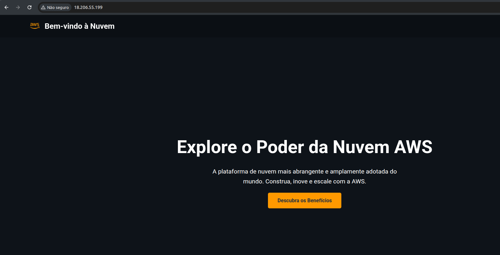

# IAC com Terraform e AWS

Neste repositório, vamos aprender a usar o Terraform e a AWS para criar a nossa primeira infra na nuvem.

Este documento também está disponível em [formato PDF](docs/README.pdf) e [formato HTML](docs/README.html) para que você possa visualizá-lo offline.

## Tabela de conteúdos

- [Pré-requisitos](#pré-requisitos)
- [Passo a passo](#passo-a-passo)
- [Erros conhecidos](#erros-conhecidos)
- [Saiba mais](#saiba-mais)

## Pré-requisitos

- Instalação do Terraform
    - https://developer.hashicorp.com/terraform/downloads?product_intent=terraform
    - **Usa Windows?** acesse esse [documento](docs/Como%20Instalar%20o%20Terraform%20no%20Windows.pdf) 
- Instalação do AWS CLI
    - https://docs.aws.amazon.com/cli/latest/userguide/getting-started-install.html
- Criando usuário na AWS
    - [**Acesse esse documento**](docs/Criação%20de%20usuário%20na%20AWS%20e%20chave%20de%20acesso%20para%20vincular%20ao%20AWS%20CLI%20na%20sua%20maquina.pdf)
- Realizar login no AWS CLI
    - `aws configure`

## Passo a passo 

Vamos começar a diversão! 🥳

1. Comece fazendo o clone do repositório:
    > [!TIP]
    > Se você preferir usar o Github é só trocar a URL do repositório para `https://github.com/avanti-dvp/iac-com-terraform-e-aws.git`

    ```bash
    git clone https://gitlab.com/avanti-dvp/iac-com-terraform-e-aws.git
    cd iac-com-terraform-e-aws
    ```

    > [!NOTE]
    > Se você não tem o Git instalado ou não sabe usá-lo, sem problema algum, você pode simplesmente fazer o [download do repositório](https://gitlab.com/avanti-dvp/iac-com-terraform-e-aws/-/archive/main/iac-com-terraform-e-aws-main.zip) e descompactá-lo em sua pasta/diretório de trabalho ou na pasta/diretório de seu usuário

2. Vamos abrir o Visual Studio Code no diretório do repositório:
    ```bash
    code .
    ```

3. Dentro do Visual Studio Code, crie um arquivo chamado `provider.tf`, incluindo esse trecho abaixo nele:
    ```hcl
    terraform {
        required_providers {
            aws = {
                source  = "hashicorp/aws"
                version = "~> 5.0"
            }
        }
    }
    
    provider "aws" {
        region = "us-east-1"
    }
    ```

    > [!TIP]
    > O arquivo `provider.tf` é o arquivo que define o provedor que será usado para criar a infraestrutura na nuvem, nesse caso, a AWS.
    > Este arquivo é uma convenção entre os desenvolvedores, ele é opcional, mas é uma boa prática ter ele.

4. Agora vamos criar o arquivo `key_pair.tf`, incluindo esse trecho abaixo nele:
    ```hcl
    # Gera uma chave privada RSA de 4096 bits
    resource "tls_private_key" "rsa_key" {
        algorithm = "RSA"
        rsa_bits  = 4096
    }

    # Cria o Key Pair na AWS usando a chave pública gerada
    resource "aws_key_pair" "ec2_key_pair" {
        key_name   = "ec2-instance-key" # Nome do key pair na AWS
        public_key = tls_private_key.rsa_key.public_key_openssh
    }

    # Salva a chave privada em um arquivo local
    resource "local_file" "private_key_pem" {
        content  = tls_private_key.rsa_key.private_key_pem
        filename = "${path.module}/ec2-instance-key.pem"

        # Define as permissões do arquivo para que apenas o proprietário possa ler e escrever
        file_permission = "0600"
    }
    ```

    > [!TIP]
    > O arquivo `keypair.tf` é o arquivo que define a criação de um par de chaves na AWS.

5. Agora vamos criar o arquivo `security_group.tf`, incluindo esse trecho abaixo nele:
    ```hcl
    # 1. Security Group para liberar a porta 80 (HTTP) para qualquer origem
    resource "aws_security_group" "http_sg" {
        name        = "allow-http-sg"
        description = "Allow HTTP inbound traffic"

        ingress {
            from_port   = 80
            to_port     = 80
            protocol    = "tcp"
            cidr_blocks = ["0.0.0.0/0"]
        }

        tags = {
            Name = "allow-http"
        }
    }

    # 2. Security Group para liberar a porta 22 (SSH) para um IP específico
    resource "aws_security_group" "ssh_sg" {
        name        = "allow-ssh-sg"
        description = "Allow SSH inbound traffic from a specific IP"

        ingress {
            from_port   = 22
            to_port     = 22
            protocol    = "tcp"
            cidr_blocks = [var.meu_ip_publico]
        }

        tags = {
            Name = "allow-ssh"
        }
    }

    # 3. Security Group para liberar todo o tráfego de saída (Egress)
    resource "aws_security_group" "egress_all_sg" {
        name        = "allow-all-egress-sg"
        description = "Allow all outbound traffic"

        egress {
            from_port   = 0
            to_port     = 0
            protocol    = "-1" # "-1" representa todos os protocolos
            cidr_blocks = ["0.0.0.0/0"]
        }

        tags = {
            Name = "allow-all-egress"
        }
    }
    ```

    > [!TIP]
    > O arquivo `security_group.tf` é o arquivo que define a criação dos security groups na AWS.

6. Agora vamos criar o arquivo `data.tf`, incluindo esse trecho abaixo nele:
    ```hcl
    data "aws_ami" "amazon_linux" {
        most_recent = true
        owners      = ["amazon"]

        filter {
            name   = "name"
            values = ["amzn2-ami-hvm-*-x86_64-gp2"]
        }
    }
    ```

    > [!TIP]
    > O arquivo `data.tf` é o arquivo que define um datasource responsável por buscar o id da imagem (AMI) mais recente do Amazon Linux 2.

7. Agora vamos criar o arquivo `ec2.tf`, incluindo esse trecho abaixo nele:
    ```hcl
    # Cria a instância EC2
    resource "aws_instance" "web_server" {
        ami           = data.aws_ami.amazon_linux.id
        instance_type = "t2.micro"
        user_data     = base64encode(file("user_data.sh"))

        # Define o key pair para a instância
        key_name      = aws_key_pair.ec2_key_pair.key_name

        # Associa os 3 Security Groups à instância
        vpc_security_group_ids = [
            aws_security_group.http_sg.id,
            aws_security_group.ssh_sg.id,
            aws_security_group.egress_all_sg.id
        ]

        tags = {
            Name = "WebServer-DVP"
        }
    }
    ```

    > [!TIP]
    > O arquivo `ec2.tf` é o arquivo que define a criação da instância EC2 na AWS.

8. Agora vamos criar o arquivo `outputs.tf`, incluindo esse trecho abaixo nele:
    ```hcl
    # Bloco para exibir o IP público da instância após a criação
    output "instance_public_ip" {
      description = "IP público da instância EC2"
      value       = aws_instance.web_server.public_ip
    }

    output "website_url" {
        description = "URL do site provisionado."
        value       = "http://${aws_instance.web_server.public_ip}"
    }
    ```

    > [!TIP]
    > O arquivo `outputs.tf` é o arquivo que define as saídas que serão exibidas após a criação da infraestrutura, nesse caso, o IP público da instância EC2.

9. Agora vamos criar o arquivo `variables.tf`, incluindo esse trecho abaixo nele:
    ```hcl
    variable "meu_ip_publico" {
        type        = string
        description = "Endereço IP público para o Security Group SSH"
        # IMPORTANTE: Substitua pelo seu endereço IP público
        # Para saber o seu IP público, acesse https://www.whatismyip.com/
        default     = "203.0.113.25/32"
    }
    ```

    > [!TIP]
    > O arquivo `variables.tf` é o arquivo que define as variáveis que serão usadas na infraestrutura, nesse caso, o IP público para o Security Group SSH.

10. Boa! terminamos de criar todos os arquivos necessários para a criação da infraestrutura na nuvem.

11. Agora vamos iniciar o fluxo de trabalho do Terraform para criar a infraestrutura na nuvem:
    ```bash
    terraform init
    terraform plan
    terraform apply
    ```

    > [!NOTE]
    > O comando `terraform init` inicializa o Terraform e baixa os providers necessários para a criação da infraestrutura na nuvem.
    > O comando `terraform plan` cria um plano de execução que mostra as alterações que serão feitas na infraestrutura na nuvem.
    > O comando `terraform apply` aplica as configurações definidas nos arquivos .tf e cria a infraestrutura na nuvem.

12. Se tudo rodar com sucesso, você verá o IP público da instância EC2 e a URL do site provisionado, basta acessá-lo através dessa URL no seu navegador para ver o site está no ar.

> [!WARNING]
> A maioria dos navegadores modernos força o redirecionamento da página para HTTPS
> Como não subimos o site em HTTPS, a conexão não irá acontecer
> Portanto, para ver o site funcionando, você precisa adicionar o http:// no começo da URL antes do IP na barra de endereço do seu navegador

E ele deverá aparecer dessa forma:



13. Para destruir a infraestrutura na nuvem, execute o comando abaixo:
    ```bash
    terraform destroy
    ```

    > [!NOTE]
    > O comando `terraform destroy` destrói a infraestrutura na nuvem que foi criada pelo Terraform.
    > **RECOMENDADO:** Sempre que você criar uma infraestrutura na nuvem, certifique-se de destruí-la quando não estiver mais usando.

## Saiba mais

- [Documentação do Terraform](https://developer.hashicorp.com/terraform)
- [Documentação do Provider AWS do Terraform](https://registry.terraform.io/providers/hashicorp/aws/latest/docs)
- [Lista de Providers do Terraform](https://registry.terraform.io/browse/providers)
- [Documentação da AWS](https://docs.aws.amazon.com/pt_br/)

